# RBT: 红黑树

## 性质

### 满足二叉搜索树的所有性质
- 左子树 ≤ 父节点 < 右子树
- 每个父节点至多有两个子节点

### 红黑树基本性质
- 颜色性质(color property): 每个节点只能是红色或黑色
- 红节点性质(Red Child property): 红红不相邻
- 黑根性质(Black Root Property): 根节点一定是黑的
- 黑高性质(Black-Height Property): 从根节点到NIL叶子节点的每一条路径上的黑色节点数都是一样的

## 操作

### 插入(Insert)
- 基本规则
    - 按BST要求插入
    - 新节点默认红色

- 修复: 仅当父节点也为红色是发生(设 N=新节点， P=父节点， U=叔节点， G=祖父节点)，主要操作为旋转和变色
    
    - Case1: 红叔 
        
        - 结构
        ```
               G(黑)
             /     \
            P(红)   U(红)
           /
        N(红)
        ```
        
        - 违反规则：
        P & N 红红不能相邻
        
        - 修复方法：
        G -> 红
        U & P -> 黑
        ```
               G(红)
             /     \
            P(黑)   U(黑)
           /
        N(红)
        ```
        P.S. 节点G还需要继续往上检查是否有冲突

        - 总结：红叔 - 爷叔父变色，爷作为新节点往上判断修复
    
    - Case2: 黑叔（空节点也算黑）
        - 结构：存在RR,LL,RL,LR四种结构，使用以下方法可以不考虑结构
        - 修复方法：不论是上面结构，都按照平衡树方法调整成如下结构
        ```
               中（黑）
            /      \
        小（红）    大（红）
        ```
        - 总结：黑叔 - 爷父孙调整
- 时间复杂度
    - height ≤ 2 log(n+1)
    - 插入: O(log n)

### 删除(Deletion)

- 与BST删除基本规则相同
    - 叶子节点：直接删除
    - 一个孩子：用孩子替换
    - 两个孩子：用中序后继替换（右子树最小节点）

- 删除的节点情况
    - 只有左孩子/右孩子：删除之后直接代替，然后变色
    - 没有孩子
        - 删红节点：直接删除
        - 删黑节点：会出现双黑(Double Black)，最复杂的部分，在下一部分解决如何处理双黑
    - 左右孩子都有：一定会转化为上两种情况

- 修复Double Black（设N=当前节点，S=兄弟节点，P=父节点，R为兄的红色孩子）
    - Case1：黑兄
        - 兄弟至少有一个红孩子：变色＋旋转
            - LL,RR：R变S颜色，S变P颜色，P变黑；然后旋转P；双黑变单黑（变回普通根节点）
            - LR,RL：R变P颜色，P变黑；然后旋转P的孩子S再旋转P；双黑变单黑（变回普通根节点）
        - 兄弟孩子都是黑的（空节点也算黑）：兄弟变红，双黑上移 -> 该子树黑路同，但是在更大的树中，该子树每条路都会少一个黑节点，所以双黑不是消除而是上移，继续判断情况继续修复（递归处理）
            - P.S.双黑上移时如果遇到的是红节点直接抵消，红变黑
    - Case2：红兄
        - 兄父变色，父向双黑节点旋转
        - P.S.上面操作完成之后，此时仍存在双黑，继续递归判断属于哪种情况，然后继续修复双黑

- 具体案例
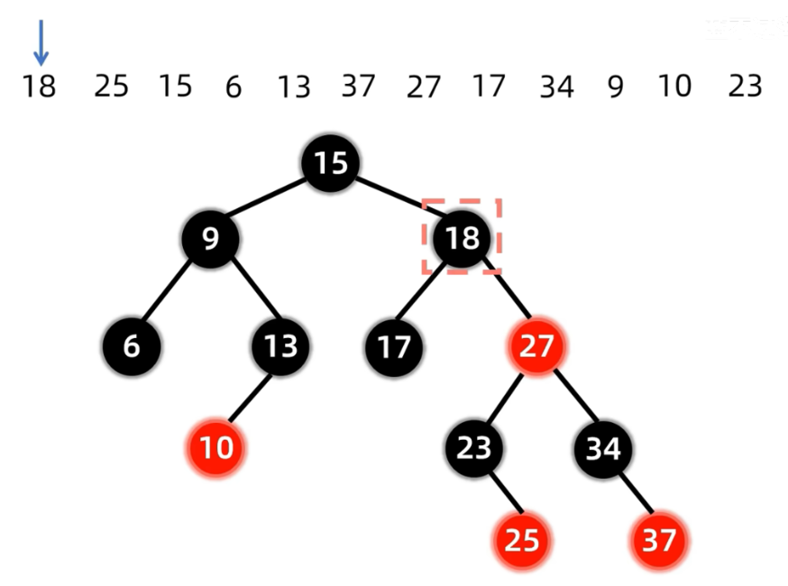
    - 首先删除黑色节点18
        - 使用BST删除的方法，发现由于18左右子树都存在，需要找后继节点代替，所以我们将23（右子树最小值）替换到原来18的位置
        - 然后我们要把原来位置的23删除，由于他只有一个右孩子，直接删除然后让右孩子25替代他，然后变黑
        - 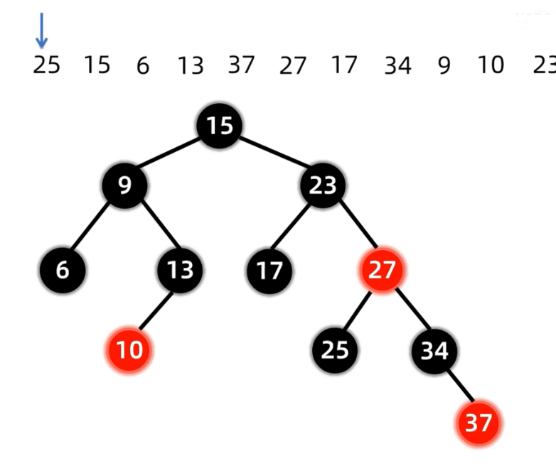
    - 然后删除黑色节点25
        - 由于25节点没有孩子，所以删除之后它会变成双黑节点
        - 此时，我们看双黑节点的兄弟节点，此处是黑色兄弟34
        - 我们继续看黑色兄弟的子节点，是红色节点37，于是我们要进行变色处理
        - 27，34，37是RR型，我们先变色，37变成34的黑色，34变成27的红色，然后27变黑
        - 接下来是旋转，27左旋，双黑恢复单黑
        - 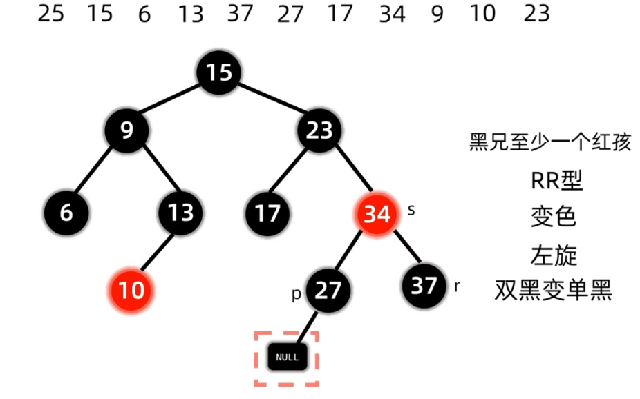
    - 接下来删除根节点15
        - 和节点18一样，我们发现他左右子树都有，寻找到他的中序后继17替代他
        - 接下来删除原来位置的黑色节点17
        - 由于17是黑色节点，删除会产生双黑
        - 我们观察到17的兄弟节点是红色的，所以进行父兄变色，父节点向双黑旋转，保持双黑继续调整
        - 所以23变红，34变黑，然后23左旋，保持双黑继续调整，此时双黑在23左子树
        - 此时双黑的兄弟是黑节点27，且27孩子都是黑色空节点
        - 所以兄弟变红，双黑上移，即27变红，双黑上移到23
        - 由于23是红色，直接抵消双黑变成单黑，结束删除
        - 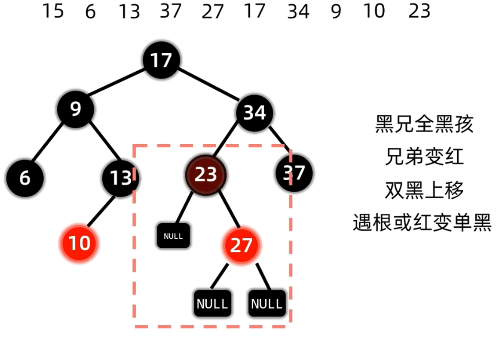
    - 接下来删除黑色节点6
        - 节点6为无孩子黑色节点，出现双黑，观察兄弟节点
        - 兄弟节点为有左红孩的黑色节点13
        - 9，13，10构成RL型，红色10变色为9的黑色，9黑色不动
        - 13进行右旋，9再左旋，双黑变单黑，删除完成
        - 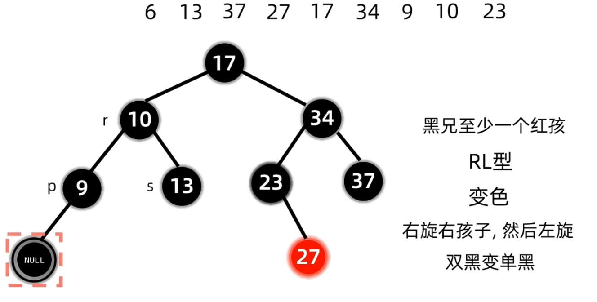
    - 接下来删除黑色节点13
        - 13是无孩子黑色节点，删除产生双黑，观察兄弟，兄弟是双黑孩子（此处空节点也算黑）的黑节点9
        - 兄弟变红，双黑上移动，所以9变红，10变双黑
        - 接下来修复10的双黑，观察10的兄弟节点，是黑色节点34，且全黑孩
        - 于是兄弟变红，双黑上移，即34变红，17为双黑
        - 由于17为根节点，直接恢复为单黑，删除完毕
        - 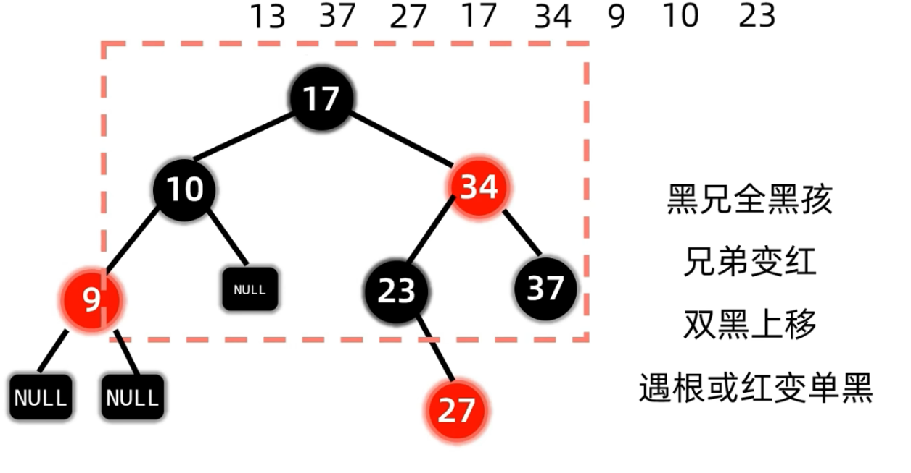
    - 接下来删黑色节点37
        - 37为无孩子黑节点，删除产生双黑，观察兄弟为有红孩的黑色节点23
        - 34，23，27形成LR型，27赋34的红色不变，34变黑
        - 23进行左旋，然后34右旋，双黑变单黑，删除完毕
        - 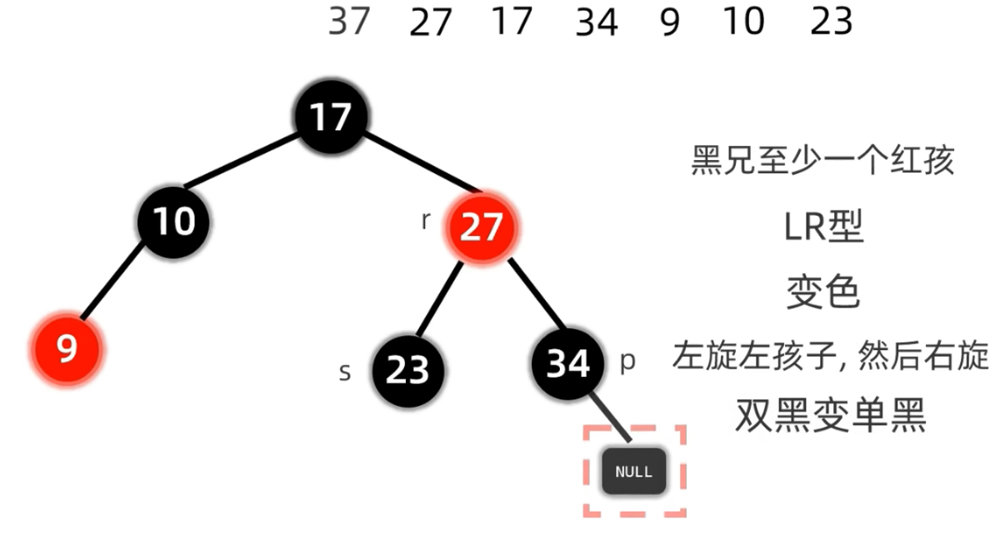
    - 接下来删除红色节点27
        - 27左右都有节点，所以找后继节点代替
        - 后继为右侧的34，替换掉27
        - 然后删除原位的黑色节点34
        - 原位的34为无孩子黑节点，产生双黑，观察兄弟，为有两个黑孩子（null）的黑节点23
        - 所以兄弟变红，双黑上移，即23变红，替换后的红34套上双黑抵消变为单黑，删除结束
        - 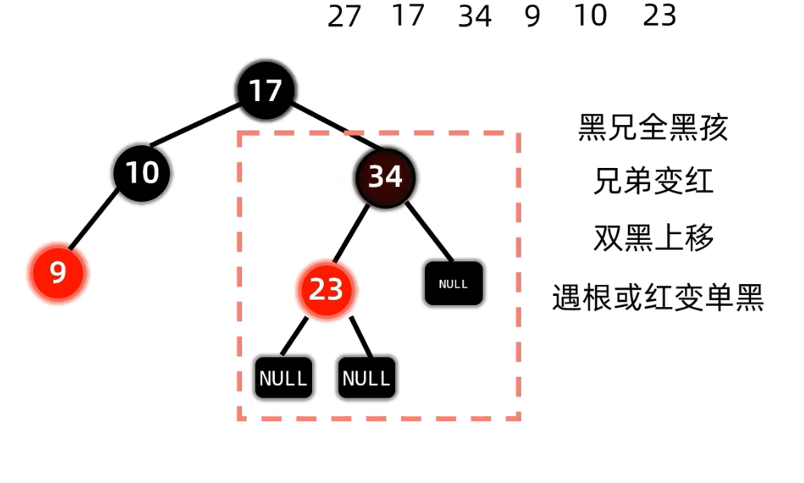
    - 然后删黑色根节点17
        - 左右子树都有，找后继，为右子树的红色23
        - 23替代17位置
        - 接下来删除原来的23，因为是红色，所以直接删除
        - 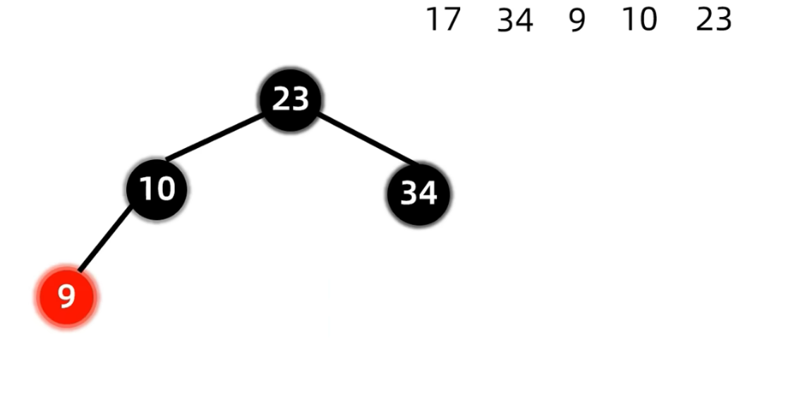
    - 接下来删黑色节点34
        - 34为无子树黑节点，删除产生双黑，看兄弟，兄弟是有红孩的黑10
        - 23，10，9为LL型，9变成10的黑色，10变23的颜色保持黑色，23保持黑色
        - 23右旋，双黑恢复单黑，删除结束
        - 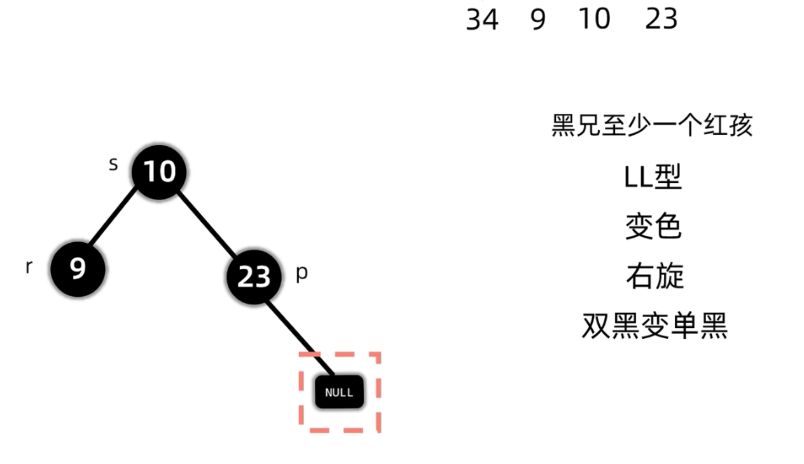
    - 然后删黑节点9
        - 9为无孩黑节点，删后产生双黑，看兄弟
        - 兄弟为双黑孩黑节点23
        - 兄弟变红，双黑上移，即23变红，10变双黑
        - 由于10是根，直接变单黑
        - 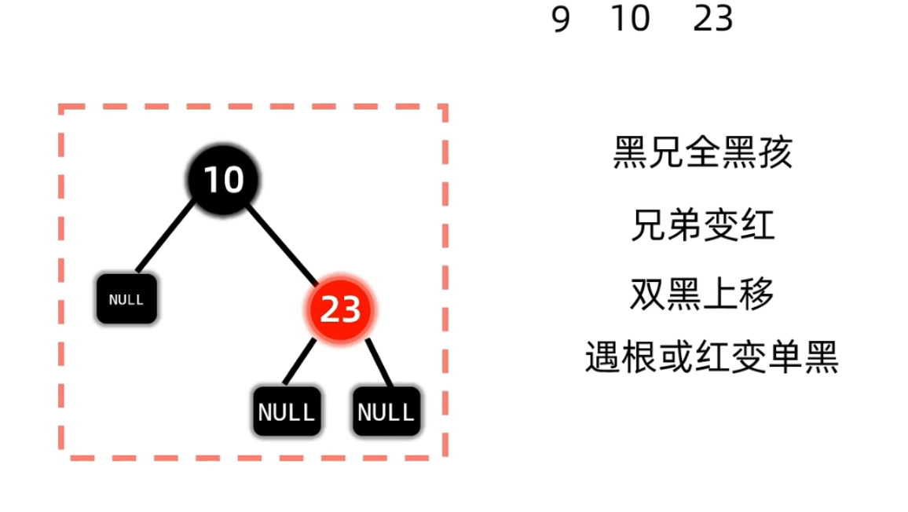
    - 10和23的删除省略，直接删除，最后变为空树

## 时间复杂度
| 操作     | 时间复杂度       | 原因                        |
| ------ | ----------- | ------------------------- |
| Insert | (O(\log n)) | 查找位置 + 最多2次旋转             |
| Delete | (O(\log n)) | 查找节点 + successor + 最多3次旋转 |

## 参考
- 插入和删除的总结和记忆参考了B站两位up主，讲的非常清晰
- 插入：[别再记LL，LR，RR，RL各种类型了，一招拿下红黑树！](https://b23.tv/2HOTdhj)
- 删除：[红黑树 - 删除](https://b23.tv/KjlbO3F)
