# B Tree：B树

## 定义
B树是一种**多路平衡搜索树（multiway balanced search tree）**，主要用于磁盘或外存储存结构（数据库、文件系统）。访问节点操作在**硬盘**进行，节点内数据操作在**内存**中进行。

## 设计动机、目的
- B树是为了解决外存访问效率问题，核心动机与目的是减少磁盘I/O次数。
    - BST/AVL/RBT 都是用来访问内存的，但是 B 树是用来外存访问的
    - 在数据库或文件系统中，**内存访问**是纳秒级别的，而**磁盘I/O**是微秒级别的，比内存访问慢10^6倍级别，所以 B 树被设计出来，用于解决磁盘 I/O 访问效率问题
    - B树的一个节点内可以存多个元素，而磁盘访问物理地址连续的元素时和访问单个元素所花费时间基本是相同的；同时，硬盘访问次数与树高正相关，储存相同数量的元素，B 树达到的树高可以比另外几种树要矮。因此达到了减少磁盘 I/O 次数的目的

## 性质
B 树具有**平衡**、**有序**和**多路**三个主要性质
### 平衡
所有的叶子节点一点在同一层
### 有序
和BST一样，任意一个元素的左子树都小于它，右子树都大于它，并且节点内也是有序的
### 多路（存在上下限）
- 对于 m 阶 B 树的节点：
    - 最多：m个分支，m-1个元素
    - 最少：
        - 根节点：2个分支，1个元素
        - 其他节点：$\left\lceil \frac{m}{2} \right\rceil$个分支，$\left\lceil \frac{m}{2} \right\rceil$-1个元素
## 操作
B 树的主要操作有：查找、插入、构建、删除

### 查找
和BST类似，从根节点开始比较，小就往左，大就往右，相同就是找到，到空节点（失败节点）都没找到就是失败

### 插入 - 主要查看上溢出(overflow)
- 插入位置一定在叶结点
- 先按照查找方法找到插入位置
    - 插入后未发生溢出：插入成功
    - 插入之后可能发生溢出，超出上限（m-1）：
        - 发生上溢出，进行分裂操作
        - 将第$\left\lceil \frac{m}{2} \right\rceil$个元素的左边和右边分开为两个分支，然后该元素上移与父节点合并，成为新左右分支的父节点

- 举例，以三阶B树为例（上限：3分支，2元素）
- 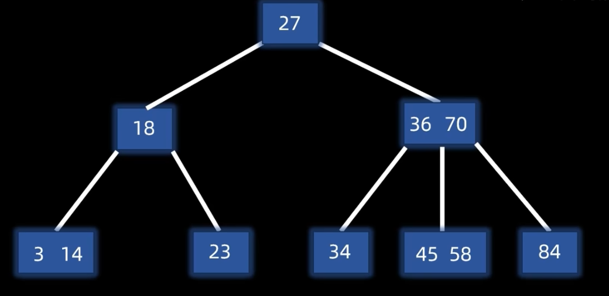
    - 无溢出插入：
        - 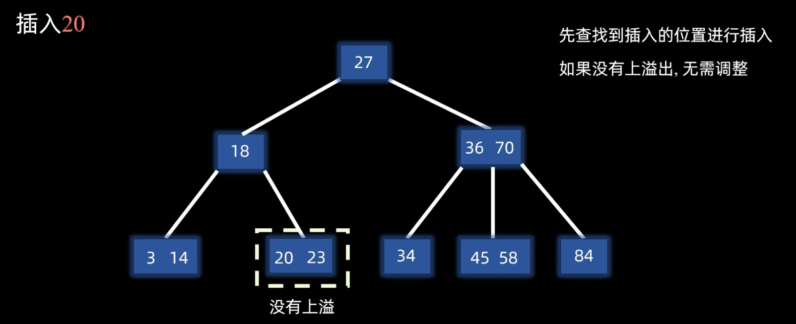
    - 有溢出插：
        - 先直接查找插入
        - 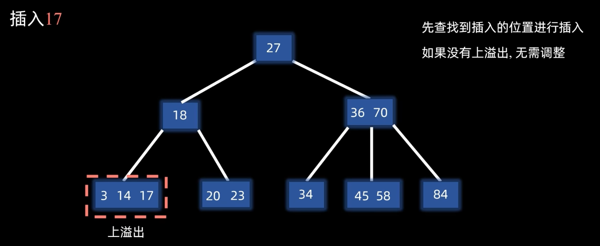
        - 发生溢出，左右分裂，节点向上合并
        - 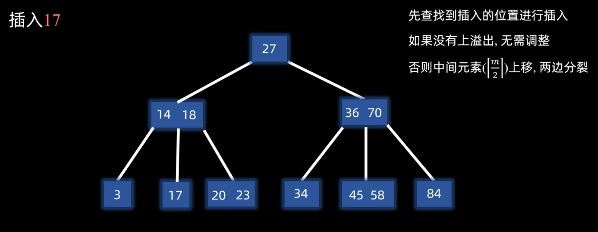

### 构建
- 与插入类似，相当于从空树开始插入
- 先一直插入根节点
- 根节点上溢出之后，以第$\left\lceil \frac{m}{2} \right\rceil$个元素为中心上移作为新根，左右分裂成为左右分支
- 接下来就和插入操作一样，无溢出直接操作，有溢出则进行节点上移和左右分裂

### 删除 - 主要出现下溢出（underflow）
- 删除非叶节点元素，最后都会转化为删除叶节点元素。因为删除规则和 BST 一样：当删除非叶节点时，它会用后继的叶节点代替，然后删除那个叶节点。
- 当删除叶节点元素时
    - 如果没有出现下溢，则无需调整
    - 如果出现了下溢出（根节点下限为1个元素，其他节点下限为$\left\lceil \frac{m}{2} \right\rceil$-1个元素）
        - 兄弟够借 -> 父节点下来，兄节点上去
        - 兄弟不够借 -> 父节点下移，然后左右合并

- 举例，以五阶B树为例（下限：根1元素；其他2元素）
- 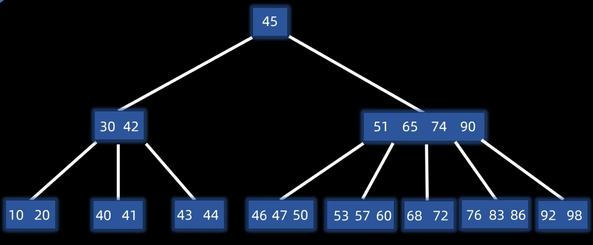
- 如果不是根节点，先按照 BST 删除规则，转化成删除叶子节点
- 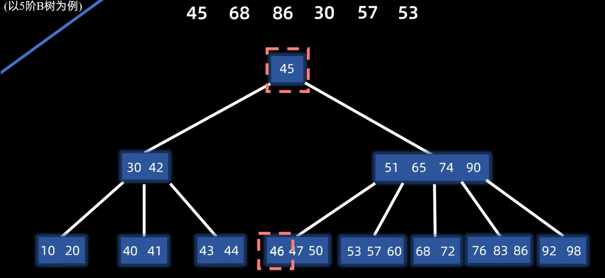 
    - 无溢出删除：
        - 然后再对叶子节点进行删除，如果发现无下溢出，则直接删除
        - 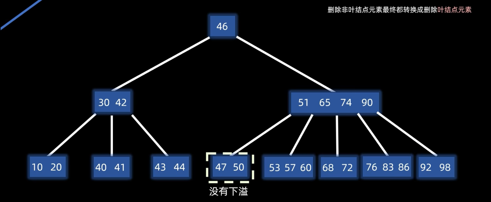 
    - 有下溢出：
        - 看兄弟是否够借，够借的话，父节点下溢，兄节点上移
        - 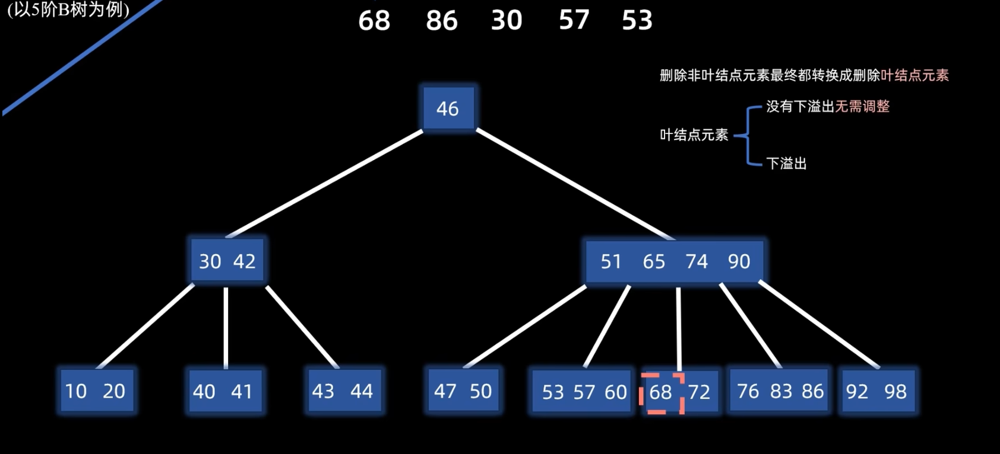 
        - 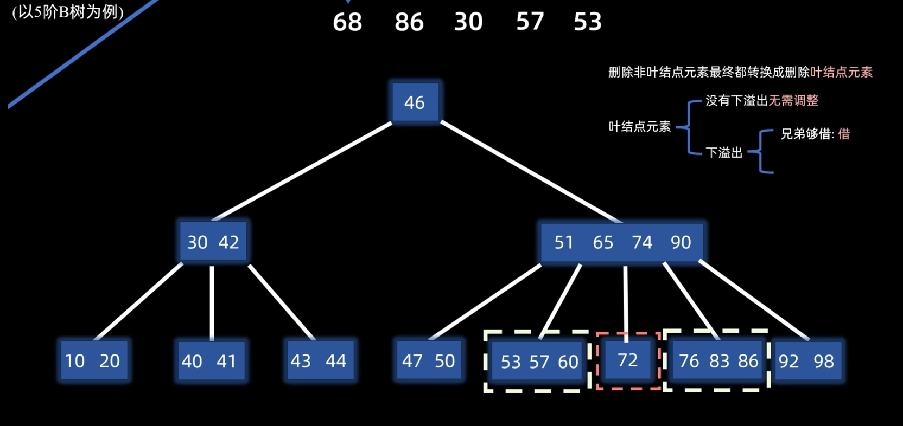 
        - 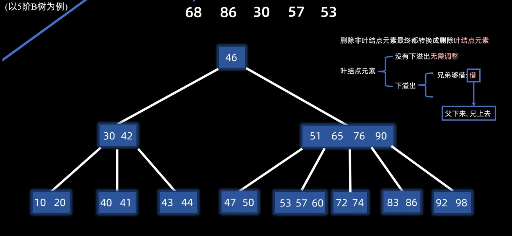 
        - 如果兄弟不够借，则父节点下移，然后左右节点合并为一个节点
        - 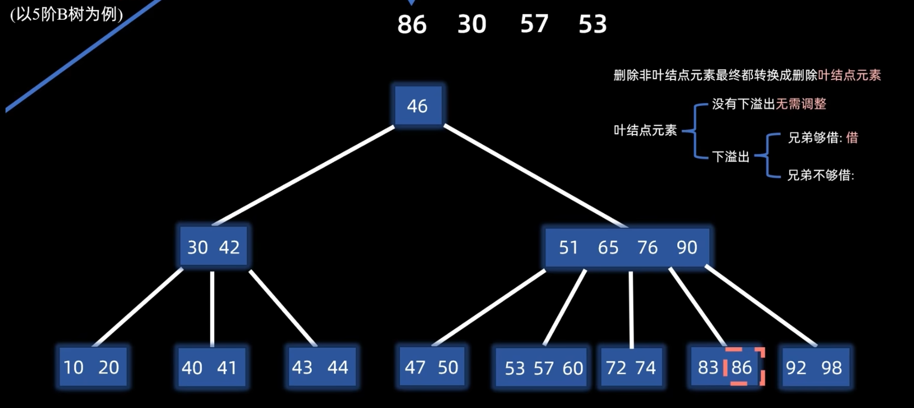 
        - 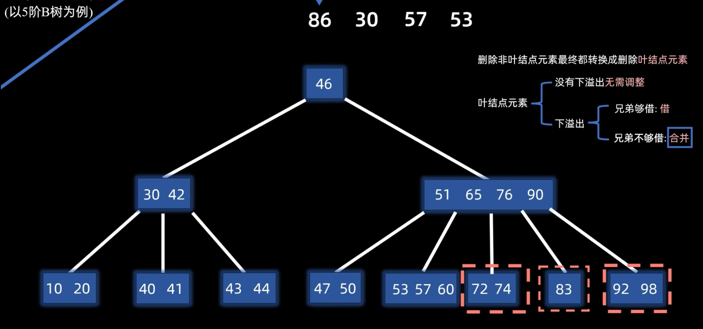 
        - 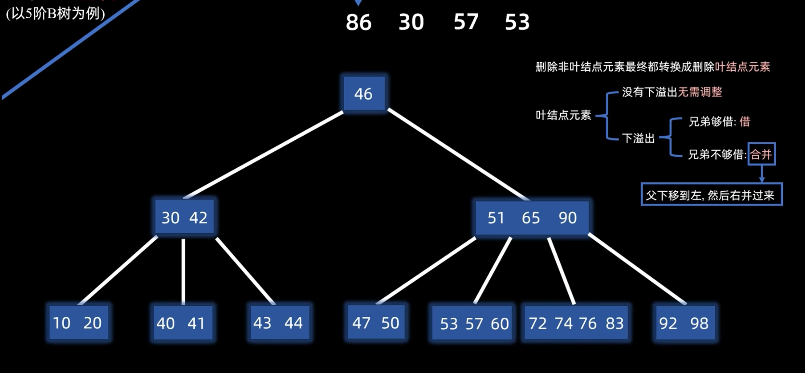 

## 2-3-4 树
- 2-3-4 树是 B 树的一种具体形式，本质上是四阶 B 树
- 节点类型只有 2、3、4 三种，分别对应了：一个元素、两个元素和三个元素
- 它和红黑树是等价结构

## 参考
- 插入/构建：[B树(B-树) - 来由, 定义, 插入, 构建](https://b23.tv/YAeqLLF)
- 删除：[B树(B-树) - 删除](https://b23.tv/3K2ANCe)
